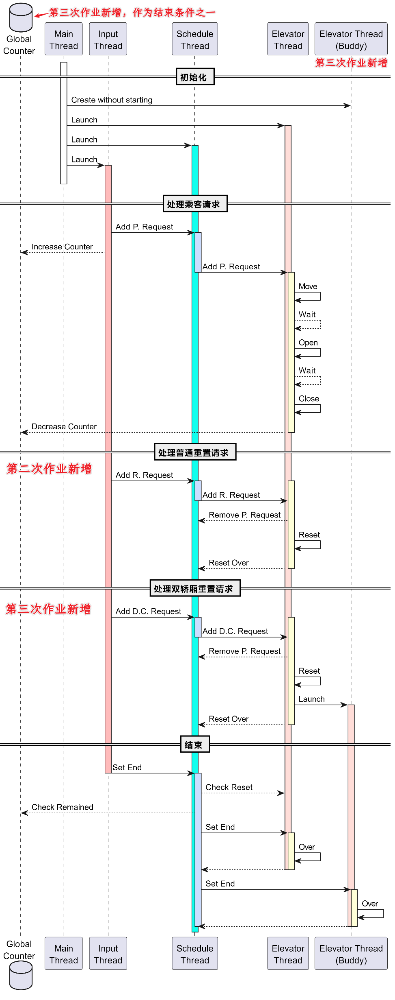
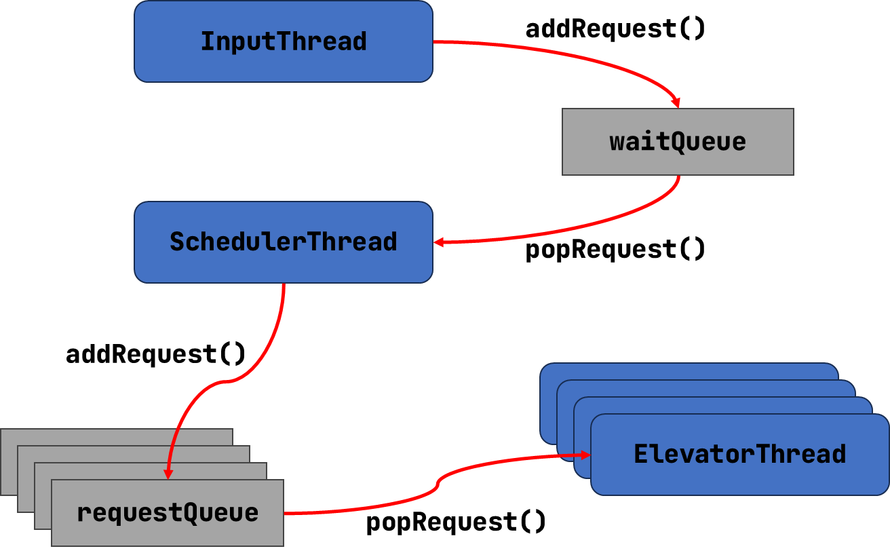
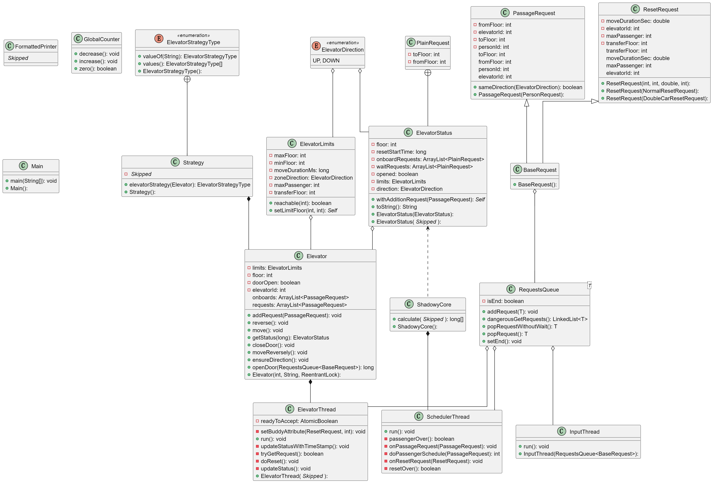
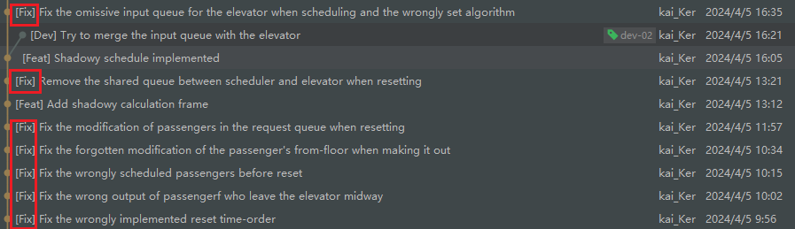
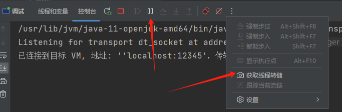

# BUAA-OO-2024 第二单元总结（多线程与电梯调度）

[TOC]

## 需求分析与架构更迭

在第二单元中，我们需要模拟电梯，通过调度器分配乘客，并能够控制电梯的运行，将乘客分配到指定的楼层。整体时序图如下，后面将有所解释。



### 第一次作业与基本架构

第一次作业仅需要实现简单的电梯运行，调度器的工作也仅仅是将乘客按照需求进行直接分配。

这一次作业中，我定下了 “输入线程” `-->` “调度器线程” `-->` “电梯线程” 这里整体的数据流向，以及 “电梯线程” 与 “电梯对象” 分离的结构。

仿照实验课的代码与思路，整体结构如同一个 **生产者 —— 消费者** 模型，输入线程通过共享队列向调度器线程传递乘客请求，而调度器拿取请求，又向与电梯的共享等待队列写入。



同时，秉持着 **线程负责运行，对象维护状态** 的理念，使用专门的电梯类来管理电梯的状态。这在后面的增量开发中发挥了重要的作用。

电梯在进行每一步动作前，会去请求队列拿去请求，并放入自己**独享的队列**中，再根据**现有状态**，计算运行策略。电梯运行采用 LOOK 算法，已有很多学长学姐留下资料，不赘述。

### 第二次作业

第二次作业增加了两项主要内容：**电梯重置**与**自由调度**。

课程组提供的输入输出包将重置请求与乘客请求抽象为 `Request`，我认为这是极有道理的。

但是我并没有完全这样做，考虑到重置请求具有**最高的优先级**，且对于每台电梯**同时只会存在一条**重置请求，我直接采用 `AtomicReference<ResetRequest>` 来向各个电梯传递重置请求。

电梯再每一步动作前，会**优先检测**是否有重置请求。如果有，则直接将乘客放出，开始重置。移除乘客时，会更新其楼层，并将其还入调度器的等待队列。

```Java
//! ElevatorThread.java
/// Main loop of the elevator thread
while (tryGetRequest()) {
    // Do Reset First!
    if (reset != null && reset.get() != null) {
        this.doReset();
        continue;
    }
    // Update status of the last loop
    this.updateStatus();
    // Maybe strange, and maybe not
    if (elevator.isDoorOpen()) {
        elevator.closeDoor();
        createTimeSnippet();  // To implement the precise sleep
        continue;
    }
    // Handle the exist request or run the elevator
    ElevatorStrategyType strategyType = Strategy.elevatorStrategy(elevator);
    // ... ... //
}
```

对于调度器来说，需要去判断使用哪一部电梯去处理乘客请求，因此它就需要**获取电梯状态**！于是，前述对象与线程分离的设计便体现出其优势了，这里避免了线程之间的复杂交互，调度器仅仅需要拿取状态即可。

关于调度算法，我采用的是**影子电梯**，根据电梯现有乘客（包括等待队列与轿厢内），计算**全部任务的完成时间**，来决定分配给哪一部电梯。理论上可以做到运行时间上的局部最优解。考虑到耗电量与运行时间的相关性，我在这里没有将运行时间纳入考量。

```Java
//! SchedulerThread.java
/// Get the time consumption of each elevator
for (int i = 0; i < ElevatorLimits.ELEVATOR_COUNT; ++i) {
    // Calculate the consumption
    synchronized (passageRequestsQueues.get(i)) {
        // The request queue will be locked duaring the calculation
        timeDelta = ShadowyCore.calculate(
                elevatorStatuses.get(i).get(), request, passageRequestsQueues.get(i)
        );
    }
    // Update the time
    if (timeDelta < minTimeDelta) {
        minTimeDelta = timeDelta;
        targetElevatorId = i + 1;
    }
}
// Return the best elevator's id
return targetElevatorId;
```

对于重置中的电梯，我也是**会参与分配的**，这样既可以避免调度器**等待重置时的轮询**，也可以避免**不平衡的分配**（主要针对大量电梯同时重置的数据）。具体方法是，**调整输出 `RECEIVE` 的时机**，由电梯输出而非调度器，这样再电梯重置时，调度器也可以放入乘客请求而不必担心错误输出。


### 第三次作业

第三次作业增加了对于双轿厢的重置，导致整体的运行逻辑发生了较大的变化。

对于双轿厢，我的解决方法是**创建 12 个电梯线程**，但特殊之处在于，一开始只启动 6 个，剩下的由主电梯分裂时启动。如协作图最后一列显示。

```Java
//! ElevatorThread.java
private void doReset() {
    // ... ... //

    // Print the "Reset Begin" //

    // Clear the shared request queue between the scheduler and the elevator
    synchronized (this.requestsQueue) {
        // ... ... //
        if (transferFloor > 0) {
            // Prepare for the buddy
            setBuddyAttribute(resetRequest, transferFloor);
            buddy.readyToAccept.set(true);
        }
    }

    // Print the "Reset End" //

    // Launch the buddy elevator
    if (transferFloor > 0) {
        buddy.start();
    }

    // ... ... //
}
```

同时，电梯内部需要维护一个 “限制”（`ElevatorLimits`），用于记录自身的属性，比如楼层上下限。

对于调度器来说，需要能够**判断出电梯是否分裂**，我采取的初步措施是，在每个电梯线程内维护一个成员变量，记录当前电梯是否 **“能够”接受请求**（这里的含义是该线程是否启动完成）。这里的时序在开发阶段除了很大问题，具体内容在后续章节中讲述。

对于未分裂的电梯，调度器会如同第二次作业一样计算影子电梯的运行代价。对于已经分裂的电梯，调度器会**假定由同一组电梯将乘客运送到目的地**，并在计算时考虑双轿厢的接力。

因为双轿厢电梯的**耗电量只有四分之一**，这就不得不将其考虑在运行代价之中。但是，测评机计算性能是将时间与耗电量分别考虑的，而这里直接相加似乎不妥，但也没有什么更好的办法，哪怕是调整其中的权重，我们也没有一个很确切的标准。

当乘客因为任何原因中途下电梯（重置、换乘层等），均会**重新进入等待队列**再次分配。

### 类图分析

下面类图已经省略了非常多的成员方法与变量，只挑了一些最主要的进行呈现。因为很多拆分、很多计算类，可以说，这次代码**组织得还是比较混乱**的。建议从下端三个 `Thread` 子类开始看整个图。



可以看出，整个结构被三个线程类分割，简析如下：

**`InputThread`** 输入线程，负责接受输入，并将输入的请求交给调度器线程。它们之间共享 `RequestQueue<BaseRequest>`。

**`SchedulerThread`** 调度器线程，从共享队列中拿取请求，并计算分给各个电梯的代价，核心是 `doPassengerSchedule` 方法，会调用影子电梯核心（`ShadowyCore`）的计算方法，分类别进行计算。调度器也会和电梯共享电梯状态，以作为计算的前提。

**`ElevatorThread`** 电梯线程，具体负责每一部电梯的运行，并**主动更新电梯状态**（`ElevatorStatus`）。


## 锁与同步

**搞清楚每个对象，会在哪些线程中，以怎样的方式被访问，确实可以帮助我们更好地加锁。**


### 同步块与锁的设置

最主要的便是请求队列的共享，通过**给核心方法上锁**可以很简单地进行线程间的安全共享。

同时，在调度器进行影子电梯计算时，我会将**对应电梯**的**请求队列锁上**，因为我不希望在计算时，电梯的状态发生改变（对于我的设计，将请求队列锁上，电梯是无法更新自身状态的，但现有运动不会被打断）。

此外，我还使用了 **原子类**，主要用的是 `AtomicReference`，电梯线程与调度器之间需要共享**重置请求**与**电梯状态**，这两个对象我均使用原子引用进行一个 wrap，极大地简化了后续的修改与使用。还有一个 `AtomicBoolean readyToAccept`，用来维护双子电梯另一半的状态，使用起来比较简单，也**不涉及反复交织的读写过程**。

在第二次作业中，为了应对**六台电梯同时重置**，导致调度器炸掉的问题，我设置了一个**资源量为 6 的信号量**。当调度器进行调度、电梯开始重置时，会试图获取一个信号量，结束时释放。本意是想让调度器在电梯全部重置时稍作等待，但我觉得这种设计时**多此一举**的。因为我设计了电梯在重置时也可以接受调度的机制，所以这里就没有用了。但是秉持着**代码能跑就不要管**的原则，也考虑到它并且没有造成很大的性能浪费，便将这种设计一直留到了最后。

在整个设计中，我一直**避免着锁或者是同步块的嵌套**，如果没有记错的话，只有一个地方涉及了同步块的嵌套，也即调度线程计算双子电梯的代价时，会依次将两个电梯的请求队列锁上。但我认为必要性不大，因为我在后续的设计中，将电梯的状态类变成了一个**不可变类**，传递用的也是原子类，只要拿到了一个状态对象，怎么捣鼓也没事。当然了，因为时间紧迫，能跑就行。

于是，这便引出了另一个我很想说的方面，我将一些**需要传递的、比较简单的类**，设置为**不可变**，直接**从源头上解决了线程安全的问题**，我觉得这种策略是很有价值的。


### 避免双轿厢碰撞

我的解决方法很简单，**给共享楼层上锁**，但 “共享楼层” 并不是一个实体，我们只需要让双轿厢的两个线程共享一把锁，并在**到达换乘层时上锁**，在**离开时释放锁**即可，要不了几行就可以解决问题。另外，在运行策略中稍作调整，**使电梯主动离开换乘层**即可。

```Java
//! Elevator.java
public void move() {
    // Arrive at the transfer floor: Get the lock!
    if (targetFloor == limits.getTransferFloor()) {
        lock.lock();
    }
    FormattedPrinter.elevatorArrive(this);
    // Leave the transfer floor: Release the lock!
    if (originalFloor == limits.getTransferFloor()) {
        lock.unlock();
    }
}
```

上面还应该注意一下**打印输出语句的位置**，必须在那个位置，也即上锁与释放锁之间！


## Bug 与 Debug

三次作业，我均没有在强测或者互测中被发现 Bug，下面对于开发过程中遇到的 Bug 与互测房友的 Bug 展开讨论。

### 开发过程中遇到的 Bug

第一次作业，我最大的困难在于 **LOOK 算法**写错了，导致电梯 “直窜天堂” 或者 “直达地府”，经过类级别的重构，我几乎重写了原先的运行策略，最终解决问题。此外，我在实施精准睡眠的时候，发现了睡眠时长为负数的情况，比如，当电梯的上一次行动是在 1s 前，那么再要 MOVE 时，便**无需等待 0.4s**，算一个小 trick 吧。

第二次作业，实现**影子电梯**并没有想象中的那么困难，但是在其它一些地方出了很多乱七八糟的问题，也浪费了一些提交次数。比如重置输出的顺序错误导致测评机错判，比如将乘客赶下电梯却忘了更新楼层等等，下面的一坨提交记录充分展现了当时的混乱场景。



第三次作业，是做的最糟糕的，各种线程之间的冲突，时序错误等，导致了很多诡异现象。其中，最令我印象深刻的是，调度器将乘客分配给了双子电梯，但是却分配给了双子到不了的轿厢。经过不断的打印、条件断点分析，将结论归结为 **调度器没有及时了解到电梯已经分裂的事实**，又因为我在电梯分裂时会重用线程，就直接炸掉了。

解决方法是：双子电梯重置时，提前进行状态更新，并在启动前，将已被分配的、不可到达的乘客请求丢弃。并且采取了下面两种保险措施：

- 电梯取请求，判断是否可达，**不可达的请求直接放回等待队列**。
- 影子电梯代价计算，设置 300 s 的门限值，超时的请求直接返回，**避免影子电梯计算时死循环**。

当然，上述两项只是保险措施，我认为它们两个的条件均不会触发，也不应该触发。

此外，我还遇到了一些**轮询**的问题，它们的原因是同样的，我认为也是比较共性的问题。关键在于调度器对于终止的判断，如果当**输入请求全部结束**，但是**调度器还不应该终止**时（比如电梯可能会将乘客丢弃，需要再次调度），可能会**发生轮询**，调度器会一遍一遍地查询情况。如果让调度器贸然地去 `wait`，可能会导致死锁（也未必，可能只是无人唤醒）。

最终的解决方法还是 `wait`，主要有俩：`passengerOver()` 与 `resetOver()`，前者等待 `GlobalCounter`，这是乘客计数器，后者等待六个重置请求。当乘客到达目的地，或者重置被相应，会触发 `notify`。这样写在强测、互测中均未被发现有问题，但在我本地测评时，会出现大概率的死锁，最后就只剩一个线程，无法退出。我认为是测评环境或者投喂器的问题。

```Java
//! SchedulerThread.java
if (waitQueue.isEnd() && waitQueue.isEmpty() && passengerOver() && resetOver()) {
    for (RequestsQueue<PassageRequest> passageRequestsQueue : passageRequestsQueues) {
        passageRequestsQueue.setEnd();
    }
    break;
}
```

### 互测房友的 Bug

和其他房友比起来，刀人不多（）

第一次作业，有一位房友线程安全没有做好，有一个 `ArrayList` 经过一系列复杂的调用关系被多个线程同时访问，造成错误。

第二次作业，发现两位房友的 Bug，均是调度问题，以及 **Reset 与调度**的处理。因为乘客到来时，电梯正在 Reset，导致了分配的不均。

第三次作业，发现两位房友的 Bug，除了调度问题，还有一个遗漏 Reset 请求的问题，我猜测是调度器过早退出导致的，但没有仔细考证。

此外，本地测评机还测出了第二次作业一位房友**也许**存在着严重的**线程安全问题**，包括但不限于**遍历时修改**等，但是并不能刀中。


### 一些 Debug 技巧

最重要的是 **给线程取名字**！默认名字真不容易看出来对应哪一个线程。

其次，可以使用 IDEA 的 **暂停程序** 或 **进程转储**，可以获取当前进程的线程信息。



此外，可以通过 Java 自带的 `jstack <pid>` 查看线程状态与线程调用栈，比较方便附加查看。


## 心得体会

**Part.1 线程安全**

第一单元的在线测评（对拍）器已经让我领会到多进程（线程）并发的 **“魅力”**，当然，自己写的东西可以通过一些不正当的手段解决问题，但如果要我们真正地、从正面地去解决线程安全问题，其难度还是相当大的。

我认为，有两个比较关键的点：搞清楚对象会在**哪些线程**，以怎样的形式**被访问**；不要假定线程间执行的时序。

第一次作业，对象较少，共享情况也比较清晰，简单加锁即可很好地达成目的。但后面两次作业，状态转换较多，共享关系也变得复杂起来，就需要更加仔细地梳理自身代码的结构。

因为线程调度的随机性，往往会发生很多意想不到事情，典型便是输出 `RESET_END` 与 `RECEIVE` 的时间，有没有可能，在某些调度情况下，接受请求会在前面输出呢？这时，就需要我们精细地、以语句为单位，对它们的顺序进行调整。

总之，线程安全是一个很难，但也很重要的话题，无论是**掌握一项知识**，还是**培养自己的能力**，都会对我们未来的发展产生十分重要的作用。


**Part.2 层次化设计**

按照我的理解，我觉得我这次的层次化设计做得还可以。从顶级的三个线程类（`Main` 就不说了），再到它们掌握的对象类（其实主要是一个 **电梯类**），以及电梯类下属的一些状态类、限制类等等。梳理一下便会非常清晰，对象在线程间的传递也会比较方便。但也导致了代码量很大，类很多的问题。

不过我认为这始终是一种应该学习、掌握的设计思路，也应该在日后的学习生活中不断精进。
